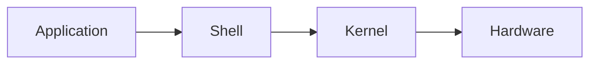

## What is Linux?

- A computer **Operating System**(OS) created by Linus Torvalds.

- The most famous examples of free software[^1] and open source development

---

## Structure

- **Application** : office, Web Browser

- **Shell** : Command Interpreter

- **Kernel** : The key interface between computer hardware and processes

- **Hardware** : Storage, Sensor, Input Device

---

## Features and Types

- It is based on an operating system called **Unix**, which is characterized by **excellent stability** and **security**, **high reliability** and **performance**.

- Manage and use system resources efficiently, support **Multi-User**[^2] and **Multi-Tasking**[^3]

- Support for both **CLI** and **GUI**

- Versatile and **powerful networking features** make it a great server OS

- **Enterprise-grade performance** on PC servers, even on less powerful PC

  <table>
    <tr>
      <th style='text-align: center'>Package format</th>
      <th style='text-align: center'>Package Manager</th>
      <th style='text-align: center'>OS</th>
    </tr>
    <tr>
      <td>Red Hat(<code>.rmp</code>)</td>
      <td>yum</td>
      <td>Cent OS, Fedora</td>
    </tr>
    <tr>
      <td>Debian(<code>.deb</code>)</td>
      <td>apt</td>
      <td>Ubuntu, Linux Mint, Raspbian</td>
    </tr>
      <td>Android(<code>.apk</code>)</td>
      <td>Android Package Manager</td>
      <td>Android OS</td>
  </table>

---

## Ubuntu

- A **Linux distribution** that uses a desktop environment built on **Debian GNU/Linux**.

- Have an interface based on **GNOME**

> [!check]- Check
> 
> - **Version number** e.g. 22.04 : April, 2022 public version 
> - **LTS**(Long Term Support) : The most stable version supported by Ubuntu for a long time (about 5 years)

---

## GUI vs CLI

> [!info]- GUI(Graphical User Interface)
> 
> - Interface commonly used by typical users
> - Graphical representations of features, such as icons and images, to make them easy to use.
> - Supports both Windows and Mac OS

> [!info]- CLI(Command Line Interface)
> 
> - Interfaces where the user and computer interact with characters to make things happen
> - Ex. Windows(**CMD**), Mac(**Terminal**)

---

## Package Manager(Apt)

- Used to install, uninstall, and update software on **Debian Linux** (`.dev`) or **derived distributions** (**Ubuntu**).[^4]

> [!NOTE]- Permissions & sudo
> 
> - Activities such as installing packages might be restricted with a `permission denied` message when typing `apt install ~~`
> 
> 

> 
> - By typing `sudo`, you can gain the privileges of **root**, the **super administrator** with full control on Linux

---

## File System

> [!abstract]-
>
> - Predetermined appointments to read and write data within a storage device
> 
> 

> 
> - **File** : A set of data stored in hardware storage, such as a memory or disk
> 
> 

> 
> - Hard disks and SSDs depend on this promise for where data is stored
> - The way we organize files so that they can be stored and retrieved is also called a filesystem.
> 
> 

> 
> - Most file systems are organized in the form of **Directorie** & **File**
> - Linux's filesystem is hierarchical with all files and directories created under the **root** file

- #### [[./FileSystem/Types.md|Types]]

- #### [[./FileSystem/Structure.md|Structure of the Directory]]

- #### [[./FileSystem/Folder.md|Permissions by Folder]]

- #### [[./FileSystem/Mount.md|Mount]]

---

## Command

> [!example]-
> 
> 

>   

>     

>       

>         <code>head</code>, <code>tail</code>
>       

>       <blockquote>
>         
Output the first and last N lines, respectively. often used with <code>cat</code>

>       </blockquote>
>       <ul>
>         <li>
>           <b>Usage</b>
>         </li>
>         <ul>
>           <li>
>             <code>cat {filename} | head -n {5}</code>
>           </li>
>           <li>
>             <code>cat {filename} | tail -n {5}</code>
>           </li>
>         </ul>
>       </ul>
>     

>     

>     

>       

>         <code>alias</code>
>       

>       <blockquote>
>         
Specify command

>       </blockquote>
>     

>     

>     

>       

>         <code>su</code>
>       

>       <blockquote>
>         
Change the current user

>       </blockquote>
>       <ul>
>         <li>
>           <b>Usage</b>
>         </li>
>         <ul>
>           <li>
>             <code>su {USER}</code> and enter <code>{PASSWORD}</code>
>           </li>
>         </ul>
>       </ul>
>     

>     

>     

>       

>         <code>more</code>
>       

>       <blockquote>
>         
Unlike <code>cat</code>, output screen by screen, spacebar down to see what's there

>       </blockquote>
>       <ul>
>         <li>
>           <b>Usage</b>
>         </li>
>         <ul>
>           <li>
>             <code>more {filename}</code>
>           </li>
>         </ul>
>       </ul>
>     

>   

>   

>     

>       

>         <code>which</code>
>       

>       <blockquote>
>         
Giving an absolute path also tells you where the command is located

>       </blockquote>
>       <ul>
>         <li>
>           <b>Usage</b>
>         </li>
>         <ul>
>           <li>
>             <code>which {command}</code>
>           </li>
>         </ul>
>       </ul>
>     

>     

>     

>       

>         <code>wc</code>
>       

>       <blockquote>
>         
Outputs the number of bytes, characters, words, and lines in a file

>       </blockquote>
>       <ul>
>         <li>
>           <b>Usage</b>
>         </li>
>         <ul>
>           <li>
>             <code>wc {option} {filename}</code>
>           </li>
>         </ul>
>       </ul>
>     

>     

>     

>       

>         <code>shutdown</code>
>       

>       <blockquote>
>         
Shutting down and rebooting the system

>       </blockquote>
>       <ul>
>         <li>
>           <b>Usage</b>
>         </li>
>         <ul>
>           <li>
>             <code>shutdown -r now</code>
>           </li>
>           <li>
>             <code>shutdown -h now</code>
>           </li>
>         </ul>
>       </ul>
>     

>     

>     

>       

>         <code>diff</code>
>       

>       <blockquote>
>         
Show the difference between two files

>       </blockquote>
>       <ul>
>         <li>
>           <b>Usage</b>
>         </li>
>         <ul>
>           <li>
>             <code>diff {filename1} {filename2}</code>
>           </li>
>         </ul>
>       </ul>
>     

>   

> 

> 
> 

> 

- #### [[./Command/Redirection.md|File Redirection]]

- #### [[./Command/Pipe.md|Pipe]]

- #### [[./Command/SSH.md|SSH]]

---

## Process

> **Process** is any **program** that is loaded into **memory** and **running on System**.

> [!abstract]-
> 
> > [!info]
> >
> > - **Program** : Collection of code (instructions) created through coding
> > - **Process** : Refers to what is happening while the program is running
> >
> > > This means that the program being executed is a process and is stored in **RAM**
> 
> - **Multi Processing** : Multiple processes created within one program
> 
> > They are all managed by the **OS**(Operating System)

- #### [[./Process/Characteristic.md|Characteristic]]

- #### [[./Process/RAM.md|Configuring RAM(Memory)]]

- #### [[./Process/Related.md|Related Command]]

- #### [[./Process/Schedule.md|Schedule Task]]

[^1]: Open Source
[^2]: Multiple users can access one system at the same time
[^3]: The ability to run multiple tasks simultaneously and take turns using the computer's resources.
[^4]: Advanced Packaging Tool
