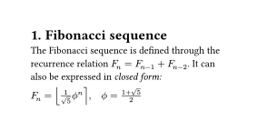

> Precise motor control typically involves multiple control loops organized in a hierarchical fashion.

   

[//]: 

> [!important] **Current Control Loop**
> 
> - Innermost, directly controlling the current flowing to the motor.
> - 
Since the torque of a motor is proportional to its current, controlling the current means controlling the torque.

> - Requires extremely fast response times.

> [!important] **Speed Control Loop**
> 
> - Located outside of the current control loop, it controls the rotational speed of the motor.
> - Get the required torque (current) command from the current control loop to maintain the target speed.

> [!important] **Position Control Loop**
> 
> - The outermost motor, which controls the rotational position (angle) of the motor.
> - Receive the required velocity commands from the velocity control loop to reach and maintain the target position.
