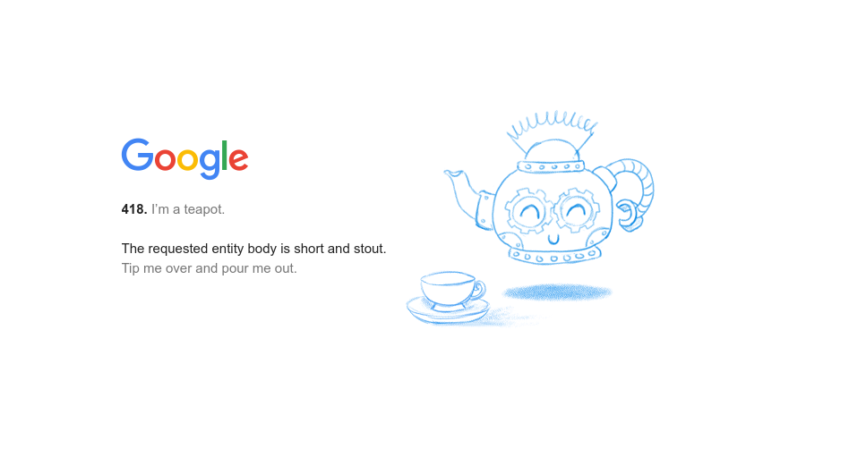

## 1 . 1 . 3 REST(ful)

### REST(Representational State Transfer)의 주요 특징

1. HTTP Protocol Usage
2. 상태 비저장(Stateless)[^less]
3. Cacheable[^cache]
4. Resource-based[^base]

### RESTful Web Service 의 핵심 개념

- `Resource` : 작업을 수행할 수 있는 Data
- `Endpoint` : 고유한 URL 과 HTTP 동사(동작)로 구성된 기능 접근

### HTTP 동사와 CRUD[^crud] 작업의 대응

- `POST` : 생성(Create)
- `GET` : 읽기(Read)
- `PUT/PATCH` : 수정(Update)
- `DELETE` : 삭제(Delete)

### RESTful Communication

- 요청 : 클라이언트가 데이터를 헤더, URL, 쿼리 파라미터, 본문에 담아 전송
- 응답 : 서버가 상태 코드, 헤더, 본문으로 응답

### HTTP 상태 코드

- 100번대 : Information
- 200번대 : Success
- 300번대 : Redirection
- 400번대 : Client Error
- 500번대 : Server Error

PS) `418` 상태 코드(I'm a teapot)는 Web 의 유머러스한 Easter Egg

[^less]: Server 가 Client 의 이전 Request을 저장하지 않는 Architecture

[^cache]: Data 를 Cache 에 저장할 수 있는 지 여부(Server 로 부터 재요청 하지 않고 Client Cache 에서 갸져올 수 있는 Data)

[^base]: `Resource` : User 가 식별하고 작업을 수행할 수 있는 Data   특정 System 이나 설계가 Resource 를 중심으로 작동하거나 조작되는 방식

[^crud]: Database 의 기본 동작인 쓰기(Create)
