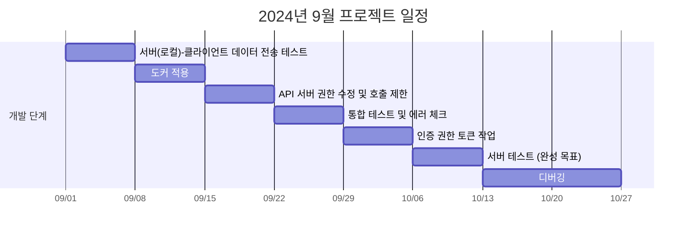

## OS

- [[Ubuntu.md|Ubuntu]]

## Software

- [[Docker.md|Docker]]
- [[ROS 2.md|ROS]]

## [[Web.md|Web]]

- [[Service & API.md|Service & API]]
- [[Concurrency.md|Concurrency]]
- [[Layer.md|Layer]]
- [[Data.md|Data]]

## [[project.md|FMCL API Server Project]]

See the [documentation](https://quartz.jzhao.xyz) for how to get started.
